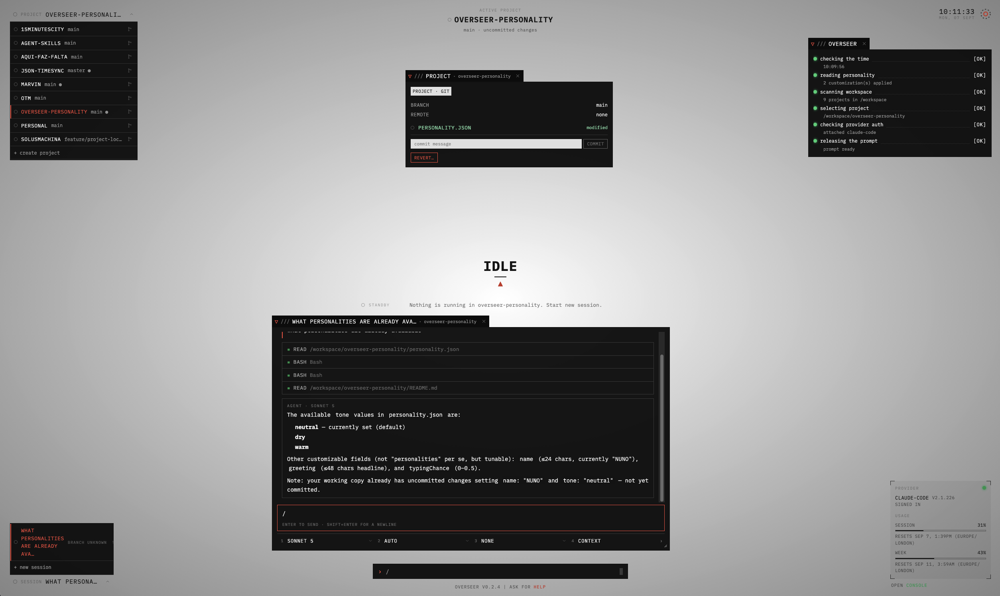
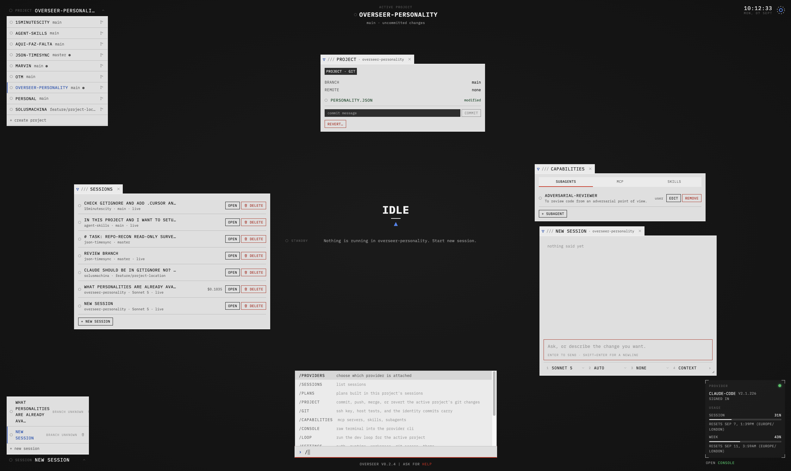

# Overseer

<p align="center">
  
  
</p>

A single-page web console for driving CLI coding agents. 

For now only `claude-code` and `cursor` are fully wired providers but others are ready to be implemented.

Built sandboxed, with the paranoid in mind: protect the host from runaway LLMs.
Agents run in Docker, not on your desktop — they cannot wipe your home directory or
reach your real accounts. The only shared surface is `/workspace`; keep those
projects on external git remotes so a bad run is recoverable.

## Trade-offs

| 🟢 Advantages | 🔴 Disadvantages |
| --- | --- |
| Sandboxed isolation from the host | A browser terminal instead of your own |
| Every CLI feature, as the provider ships it | Docker footprint instead of a single binary |
| Many agents across many projects on one desk |  |
| More observability across projects |  |
| Automatic workflows via the dev loop |  |

## Requirements

- [Docker](https://docs.docker.com/get-docker/) with Compose

Nothing else. Node, npm, and the agent CLIs all live inside the container.

## Where your projects go

Your projects do **not** live in this repo. The first run creates
`../overseer-workspace` — a directory next to this clone — and mounts it into the
container as `/workspace`, the only surface the agents get. Put a project there (clone
it, or create one from the UI) and it shows up in the panel.

It sits outside the repo on purpose: inside, a dev container saw every project twice,
and your work sat in the blast radius of the resets and cleans that overseer's own code
tree invites. To keep it elsewhere, set `OVERSEER_WORKSPACE_HOST` in `.env` — see
`.env.example`.

## This never runs on the host

Overseer and the agents it spawns always run **inside Docker**.
Provider auth lives inside the container volume not your real `~/.<agent>` folder.

They cannot reach your machine except through the workspace bind mount, which lives
outside this repo;
Workspace projects whose test commands are themselves `docker compose` get a
Docker-in-Docker sidecar rather than a bind of your host's daemon socket.

> [!WARNING]
> There is no authentication. Overseer is designed for a single developer on
> their own local machine — do not expose it on a public interface or deploy it
> as a public instance.

> [!WARNING]
> Do not start the Node server or agent CLI with host `npm` / Node — that skips the
> container entirely. `npm run dev` and `npm run dev:web` refuse outside Docker.
> Use `./bin/*` instead.

## Run (production)

```sh
./bin/start
```

Open http://127.0.0.1:3000. The compiled SPA is served by the Node server. The container
owns the agents as named volumes;

Configuration is optional and lives in `.env` — copy `.env.example` and uncomment what
you need (Compose loads it automatically). `OVERSEER_WORKSPACE_HOST` moves the workspace;
`TZ` sets the container timezone, which is what provider usage and limit reset phrases
follow. Default is UTC.

```sh
./bin/stop
```

## Develop

```sh
./bin/dev-start
```

Vite on http://127.0.0.1:5173 (hot reload), API on http://127.0.0.1:3001. The host ports
differ from production's `:3000` so both stacks can run at once. Edit files on the host —
the source tree is bind-mounted and watched.

| Command            | What it does                                                                 |
| ------------------ | ---------------------------------------------------------------------------- |
| `./bin/dev-start`  | Start the dev stack (`-d` to detach, `--build` to rebuild) |
| `./bin/dev-stop`   | Stop it; volumes survive                                                     |
| `./bin/rebuild`    | Force-rebuild images (`--prod` for production; flags pass to `compose build`) |
| `./bin/start`      | Build and run the production stack                                           |
| `./bin/stop`       | Stop the production stack                                                    |
| `./bin/logs [svc]` | Follow dev stack logs (`deps`, `server`, `web`)                              |
| `./bin/sh [svc]`   | Shell into a dev container (defaults to `server`)                            |
| `./bin/npm <args>` | Run npm inside the dev container — use for **all** dependency work           |
| `./bin/check`      | Typecheck + lint                                                             |
| `./bin/test`       | Run all unit and integration tests                                           |
| `./bin/test-e2e`   | Playwright acceptance tests (args pass through to `playwright test`)         |
| `./bin/loop <ws>`  | Open a dev-loop session on that workspace project, inside the running stack  |
| `./bin/reset`      | Tear down the dev stack and discard volumes, including agent auth            |

## Features

Overseer is a harness around the providers' own CLIs, not a replacement for them. Every
agent conversation happens in the CLI's real TUI, in a console window. Overseer adds what
a single terminal cannot: many consoles across many projects on one desk, and a view of
all of them at once.

- **Consoles** — any number of console windows, across projects, arranged freely (`/tile`
  lays them out in a grid). A console is the provider CLI (`/console`, or type a prompt
  into the prompt bar), a plain shell (`/shell`), or the dev loop (`/loop`).
- **Consoles outlive the tab** — closing a window only detaches it; the process keeps
  running on the server. A reload puts every window back where it was, with its
  scrollback. Kill is a separate, explicit control.
- **Sessions** — every provider session in the workspace, read from the CLIs' own
  transcripts. Opening one shows the console running it, or resumes it in a new one
  (`claude --resume`, `agent --resume`).
- **Monitoring** — Claude Code reports through hooks, so a console waiting on a
  permission prompt lights up and the overseer points you straight at it. Other CLIs
  are watched by their output.
- **Overseer space** — ranks what needs attention and opens the surface it refers to.
- **Wizard** — walks a fresh instance from nothing to a working setup.
- **Project panel** — persistent status for every project, plus project creation.
- **Git over ssh** — generate a key in settings, add its public half to your git host,
  and push from the app or the agent. Works with any host, self-hosted included.
- **Theme support** — samaritan (default) and machine already included.

Architecture: [docs/architecture-design.md](docs/architecture-design.md) ·
UI: [docs/ui-ux-design.md](docs/ui-ux-design.md) ·
Behavior: [docs/overseer-behavior.md](docs/overseer-behavior.md)

Themes inspired by Person of Interest created by Jonathan Nolan

### Browser tooling (optional)

A [Playwright MCP server](https://github.com/microsoft/playwright-mcp) is registered in
`.mcp.json` for editor-side click-through against a running stack
(`./bin/dev-start`). Acceptance tests still run only via
`./bin/test-e2e`.