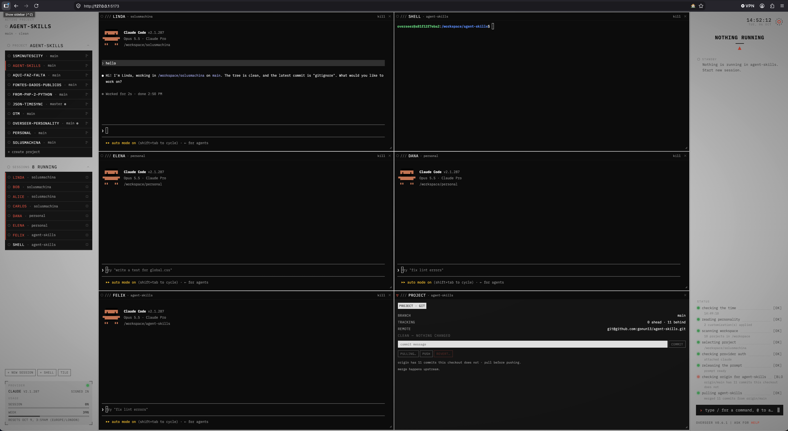
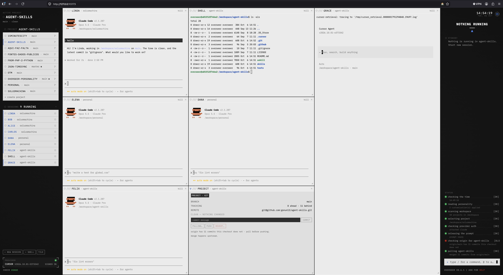

# Overseer

A single-page web console for driving CLI coding agents — Claude Code, Cursor and Codex — across
many projects at once, each in the CLI's own terminal UI. Built sandboxed, with the paranoid in
mind: agents run in Docker, not on your desktop, so they cannot wipe your home directory or reach
your real accounts. The cost is a browser terminal instead of your own, and a Docker footprint
instead of a single binary.

<p>
  
  
</p>

- **Consoles** — any number of agent, shell (`/shell`) or dev-loop (`/loop`) consoles, tiled on
  one desk. Closing the tab only detaches them; the processes keep running.
- **Sessions** — every provider session in the workspace, read from the CLIs' own transcripts,
  resumable in a new console.
- **Monitoring** — a console waiting on you lights up, and the overseer ranks what needs attention.
- **Callsigns** — every agent has a name; `@linda <message>` prompts Linda, and agents can message
  each other with `overseer tell`.
- **Dev loop** — automated feature/fix workflows for Claude and Cursor (not Codex); see
  [loop/README.md](loop/README.md).
- **Git over ssh** — generate a key in settings and push from the app or the agent, to any host.

## Install

Requires [Docker](https://docs.docker.com/get-docker/) with Compose. Node, npm and the agent CLIs
all live inside the container.

```sh
git clone https://github.com/gonun13/overseer.git
cd overseer
./bin/start
```

Open http://127.0.0.1:3000 — a wizard walks the fresh instance to a working setup. Type `/help` in
the prompt bar for every command. `./bin/stop` stops it.

Your projects do **not** live in this repo. The first run creates `../overseer-workspace` next to
the clone and mounts it as `/workspace`, the only host surface agents get; clone a project there or
create one from the UI. Keep those projects on git remotes so a bad run is recoverable. To move the
workspace, set `OVERSEER_WORKSPACE_HOST` in `.env` (see [`.env.example`](.env.example)).

> [!WARNING]
> There is no authentication. Overseer is for a single developer on their own machine — do not
> expose it on a public interface or deploy it as a public instance. [SECURITY.md](SECURITY.md)
> states the threat model and how to report a vulnerability privately.

## Develop

```sh
./bin/dev-start
```

Vite on http://127.0.0.1:5173 (hot reload), API on http://127.0.0.1:3001, so it runs alongside
production. Never use host `npm` or Node: dependency work is `./bin/npm`, and `./bin/check` and
`./bin/test` verify. Each `bin/` script documents its options in its header. The spec lives under
[`spec/`](spec/PROJECT.md); contributor rules are in [AGENTS.md](AGENTS.md).

Themes inspired by Person of Interest, created by Jonathan Nolan.

License: [MIT](LICENSE)
